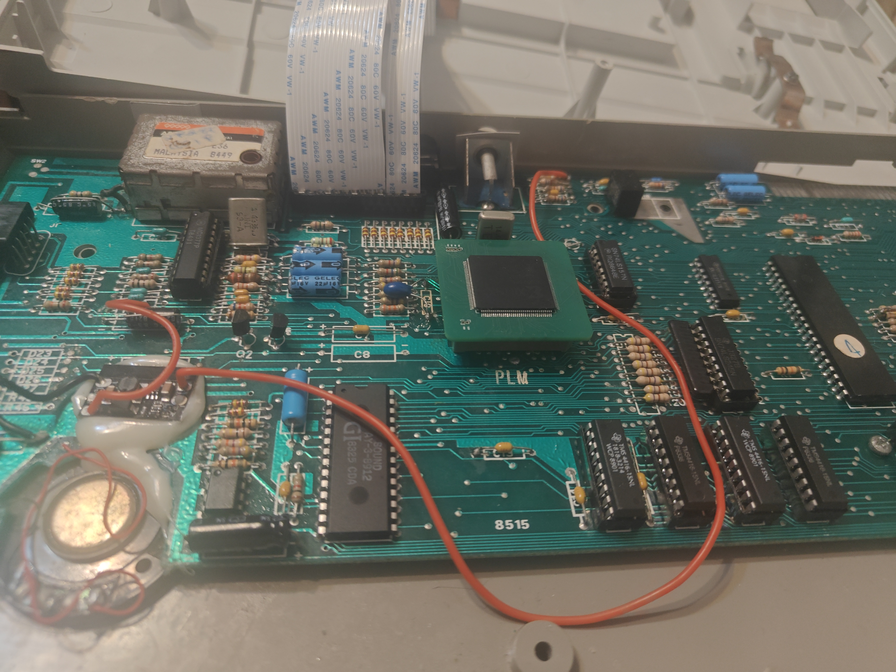
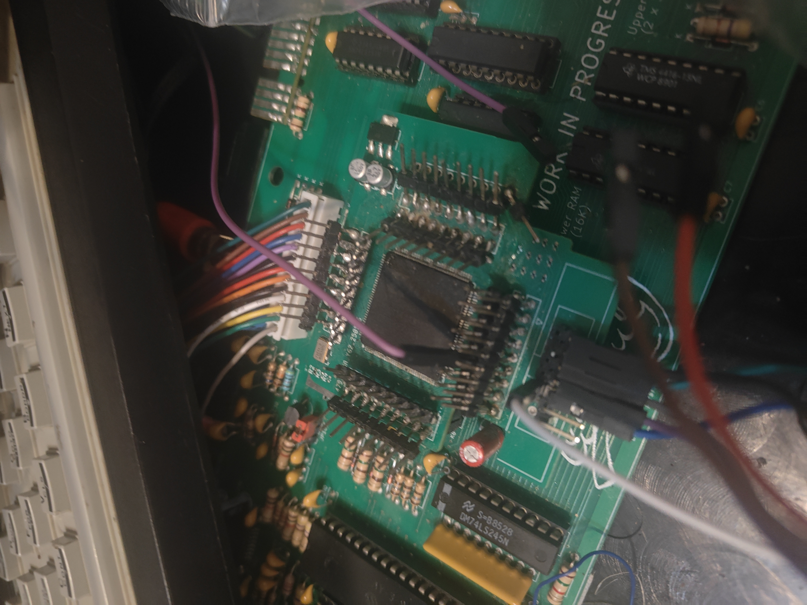
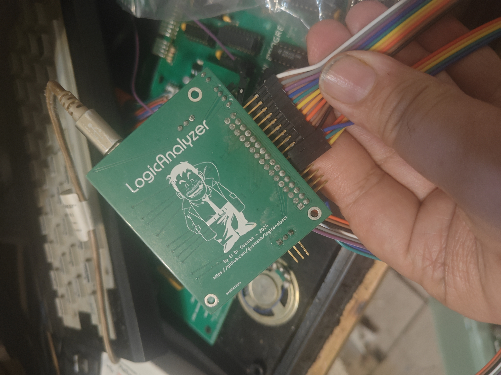
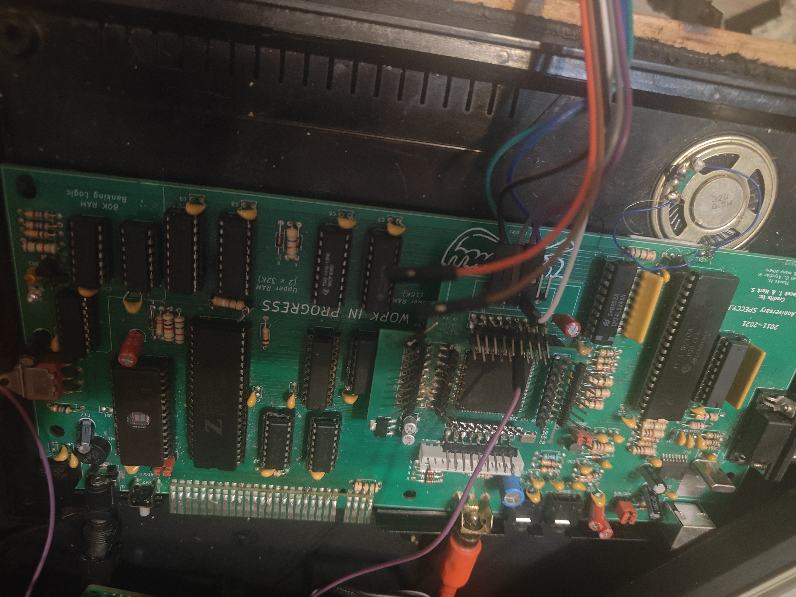
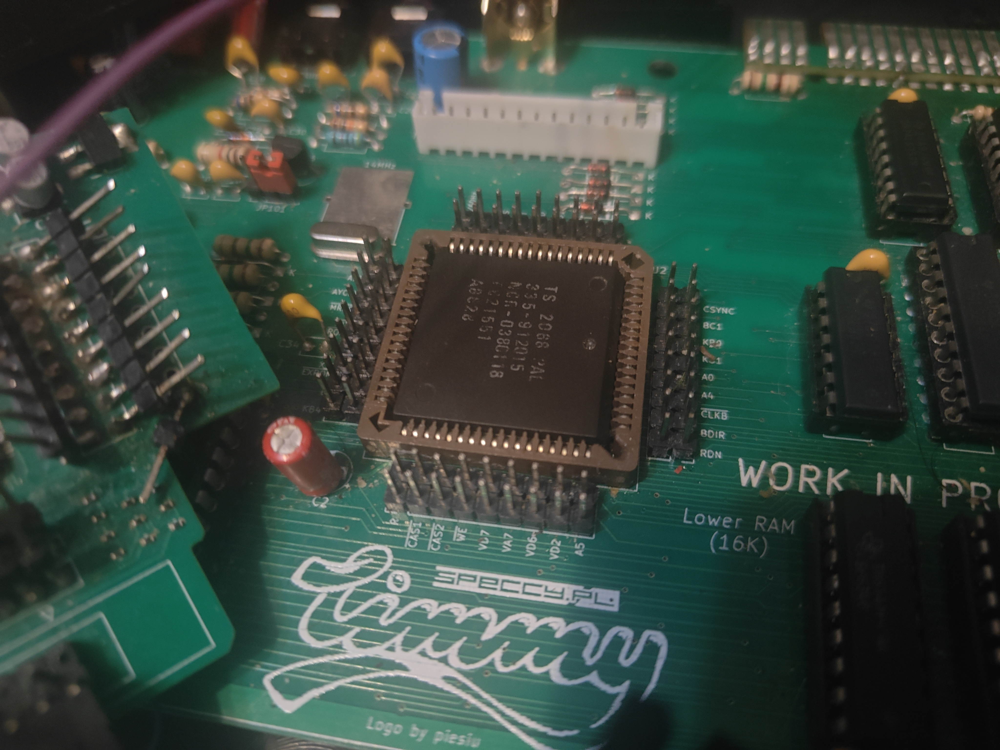

# Timex SCLD CPLD Replacement (TC2068)
Target device: Xilinx XC95288XL CPLD

A fully working CPLD replacement for the Timex SCLD — validated on real hardware.

✔ Timing fixes
✔ CMOS Z84 compatible
✔ NMOS Z80 compatible
✔ Tested on real hardware

> This is not just a simulation model — this version works on real hardware.
---

### Kicad final Beta PCB

My last iteration of the PCB (work in progress...maybe).

---

## 🎥 Demo (Real Hardware)

> ✔ Proof of real hardware operation — not just simulation

### CPLD Replacement Running (Timex 2048 "Timmy")

https://www.youtube.com/watch?v=t5ia4-bkabo

---

### CPLD Replacement Running (Timex 2068)

https://www.youtube.com/watch?v=evhCbX4_XCQ

---

## 📸 Hardware & Debug

> Real hardware validation using logic analysis and live system testing.

### Logic Analyzer (Timing Validation)

Captured signals used to debug and align timing (MREQ, RAS, CAS, multiplexing).

---

### Timex 2048 ("Timmy") Running with Guzman Logic Analyzer

System running with CPLD-based SCLD replacement, monitored using a Guzman logic analyzer.

---

### Timex 2048 Test System ("Timmy")

Initial test platform where the CPLD implementation was first validated.

---

## 🔌 Hardware Integration Details

The CPLD board was designed to interface with the original Timex hardware using a practical and non-invasive approach.

> ⚠️ No permanent modification to the original system is required (after socket installation).

---

### CPLD Prototype (Hand-Assembled)

Hand-assembled CPLD final prototype (beta version) .

---

### Development Setup (Debug & Measurement)

Temporary wiring and probe points were used during development to access internal signals for measurement and debugging.

These connections were used to:

* Probe critical signals (MREQ, RAS, CAS, etc.)
* Validate timing behaviour
* Debug hardware interactions

⚠️ Note:
Signal artifacts such as spikes/noise observed during this stage were related to the measurement setup, not the final design.

---

### Final Hardware Integration

Final CPLD implementation using right-angle (90°) pin headers.

---

### 90° Pin Integration Technique (Final Design)

Right-angle (90°) pin headers are used as part of the final design to interface the CPLD board with the installed PLCC socket.

This provides:

* Correct alignment with the socket
* Reliable electrical connections
* Mechanical stability
* Easy installation and removal

---

### PLCC Socket Adaptation

The original SCLD is soldered directly to the motherboard in Timex machines.

For this project, a PLCC socket was installed to allow easy testing and replacement without repeatedly soldering components.

This enables:

* Safe insertion and removal of the CPLD board
* Faster development iterations
* Reduced risk of damage to the motherboard

---

## ⚡ Quick Start

1. Program the CPLD with `scld_devboard.jed`
2. Insert into the installed PLCC socket
3. Power on

Done.

---

## 🧠 Overview

This project implements the Timex TC2068 SCLD using a CPLD.

Used in:

* Timex Computer 2048
* Timex Computer 2068

The SCLD is responsible for:

* Memory paging
* Video timing
* Bus arbitration
* DRAM access

---

## 🔧 What was fixed / improved

The original implementation worked on the Timex 2048 with some limitations and was implemented on a smaller CPLD.

However, it was incomplete and did not correctly support key features required for full Timex 2068 compatibility.

This implementation focuses on correct behaviour on real hardware and full system compatibility.

Key improvements include:

- Proper support for Timex 2068 memory paging  
- Implementation of missing I/O behaviour (`IN FF`, `IN F4`)  
- Correct handling of bank switching and EXROM behaviour  
- Timing fixes for reliable operation with both NMOS and CMOS Z80 CPUs  
- Improved stability and DRAM access behaviour  
- Full validation on real hardware (not just simulation)  
---

## 🧪 Development Process

* Started from original VHDL implementation
* Observed incorrect behaviour on real hardware
* Analysed signals using a logic analyzer
* Adjusted timing and internal logic
* Tested with multiple Z80 variants (NMOS / CMOS)
* Validated behaviour against real systems

---

## 🧪 Development Approach

The project evolved through direct hardware testing rather than strict schematic-first design.

Key fixes were implemented and validated directly on the PCB.

---

## 🧰 Hardware

### Final PCB

`Hardware/PCB/Beta/`

Final PCB design used for the working CPLD-based SCLD replacement.

---

### Prototype PCB

`Hardware/PCB/prototype`

Early prototype used during development and testing.

---

### Prototype Schematic

`Hardware/Schematics`

⚠️ Note:
This schematic corresponds to the prototype stage and may differ from the final PCB.

---

## 💾 Firmware

### Prebuilt

`firmware/jed`

* `scld_devboard.jed` → ready to program

---

### Source Code

`firmware/src/`

* VHDL implementation of the SCLD

---

### Constraints

`firmware/constraints/`

* UCF file defining CPLD pin mapping

---

### Xilinx Project

`firmware/xilinx/full_project/`

Full Xilinx ISE project used during development.

⚠️ Note:
Includes generated files (`remote/`, logs, etc.) to preserve the working environment.

Rebuilding is optional — the `.jed` file is sufficient.

---

## 🔍 Validation

Validated against real hardware:

* Video output behaviour
* Memory timing
* System stability
* CPU interaction timing

---

## 🙏 Credits

Based on work from:

- Load ZX Spectrum Museum  
- Álvaro Lopes  
- Paulo Cortesão  

Support:
- João Diogo 
- Hugo Pinto
- Marco Pais
- Inácio Santos
- Fernando

---

### 🧪 Technical Support & Testing

Special thanks to Rui Ribeiro:

- Provided  ROMs used for validation  
- Helped verify behaviour against real systems  
- Shared knowledge of Timex hardware and timing and the weird timex 2068 paging...

---

### 🧠 Implementation (VHDL, Hardware & PCB Design)

- António Vítor  

Complete implementation and validation:

- VHDL development and debugging  
- Timing fixes (MREQ, RAS/CAS, multiplexing)  
- Hardware design and integration  
- PCB design using KiCad  
- CPLD implementation and testing  
- Real hardware validation  

This includes both the logic implementation and the full hardware solution.

---

## 📜 License

Creative Commons Attribution-ShareAlike 4.0 International License

https://creativecommons.org/licenses/by-sa/4.0/

---

## ⚖️ Trademarks

TIMEX is a trademark of TIMEX GROUP USA, INC

The authors are not affiliated with or endorsed by the trademark holders.

Xilinx is a registered trademark of Xilinx, Inc.
